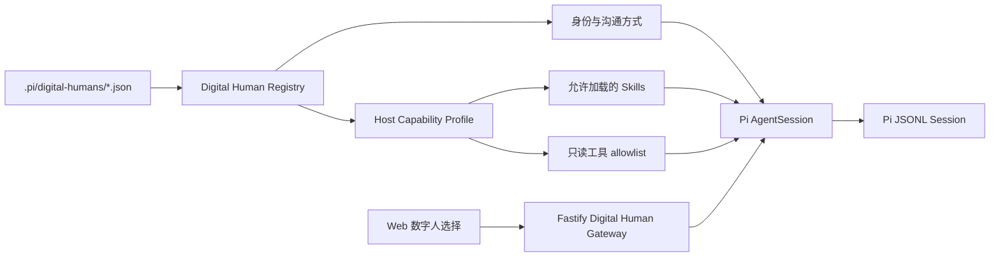

# Pi Workbench 数字人设计

## 结论

数字人是产品中的长期角色，Pi `AgentSession` 是承载角色运行的执行实例。姓名、职业、人设、沟通风格和欢迎内容由 `.pi/digital-humans/*.json` 定义；工具、Skill 和数据域由宿主维护的能力档案决定。

本设计不引入 Python Agent、第二套 Agent 框架、旧 Agent ID 兼容层或本地降级回答。

## 当前数字人

| 数字人 | 职业角色 | 能力档案 | 只读工具 |
|---|---|---|---|
| `project-steward` / 小派 | 项目知识管家 | `project-knowledge` | `read`、`search_knowledge` |
| `commerce-analyst` / 林澈 | 电商经营分析师 | `business-analytics` | `read`、`query_business_data` |

数字人档案不包含工具字段。运行时解析 `capabilityProfile` 后，由宿主补充最终工具和 Skills，防止项目 JSON 扩大权限。

## 数字人档案

每个档案必须定义：

- `schemaVersion`、`order` 和稳定 `id`；
- `displayName`、`role`、`tagline` 和说明；
- 头像文字与受控色彩；
- `identity`、`mission`、人格特征、沟通风格和行为原则；
- 一个宿主已注册的 `capabilityProfile`；
- 欢迎标题、介绍和建议问题。

档案加载采用严格校验。未知能力档案、重复 ID、非法头像色彩或缺失字段都会阻止运行，不做推断和迁移。

## 运行结构



HTTP 网关根据用户显式选择的 `digitalHumanId` 加载档案，不根据消息关键词选择数字人。进入 Pi 后，仍由 Pi 判断直接回答还是调用当前能力档案允许的工具。

## Session 隔离

每个 Session 创建时写入不可变 custom entry：

```json
{
  "type": "custom",
  "customType": "pi-workbench.digital-human",
  "data": { "digitalHumanId": "commerce-analyst" }
}
```

规则：

- Session 只属于一个数字人；
- 请求携带 `digitalHumanId + sessionId`；
- 不一致返回 `409 DigitalHumanSessionMismatch`；
- 运行时缓存键为 `digitalHumanId + ':' + sessionId`；
- 没有当前数字人 binding 的 Session 无效，不加载、不推断、不迁移；
- 只有带完整 turn metadata 的消息才进入 Web 投影。
- `.pi/sessions/*.jsonl` 不进入项目资源浏览器；Session 只能通过携带 `digitalHumanId` 的专用会话接口读取和修改。

## 经营分析能力档案

`business-analytics` 使用一次受约束语义查询：

```text
用户问题
  -> 林澈理解业务意图
  -> query_business_data 提交认证指标 / 维度 / 时间 / 枚举筛选
  -> 宿主校验并执行参数化 SQLite 聚合
  -> BusinessAnalyticalResult
  -> BusinessPresentationPlan
  -> Pi 生成结论、业务含义和建议
  -> Web Adapter 生成 json-render Spec
```

一次调用最多组合 3 个指标、2 个维度、4 个筛选和 50 行结果。工具不接受 SQL、表名、列名、表达式或身份范围。

查询结果是唯一事实源。展示计划只引用字段；Web 才将它转换为受 Catalog 约束的 KPI、折线图、柱状图、表格、数据范围和限制提示。稀疏序列保留缺失点，不补造零值；无效计划直接报错。

## HTTP 合同

| 方法 | 路径 | 用途 |
|---|---|---|
| `GET` | `/api/v1/digital-humans` | 返回文件定义的数字人 |
| `GET` | `/api/v1/digital-humans/workspace` | 返回数字人、项目资源和运行状态 |
| `GET` | `/api/v1/digital-humans/sessions?digitalHumanId=...` | 返回指定数字人的会话 |
| `POST` | `/api/v1/digital-humans/sessions` | 以 `{ digitalHumanId }` 创建会话 |
| `POST` | `/api/v1/digital-humans/chat` | 发起非流式 Pi turn |
| `POST` | `/api/v1/digital-humans/chat/stream` | 发起 SSE Pi turn |

请求和响应使用 `digitalHumanId`。旧 `agentId`、旧路径和旧响应结构不存在。

## 定义新数字人

如果复用现有能力档案，只需新增一份 JSON：

1. 选择唯一 ID、姓名和职业；
2. 写清身份、使命、沟通风格和原则；
3. 引用 `project-knowledge` 或 `business-analytics`；
4. 添加欢迎内容和建议问题；
5. 重启服务并完成档案、工具、Session 和浏览器验收。

只有在现有能力档案无法满足时才修改宿主代码新增能力。新增能力必须显式定义工具 allowlist、Skill 过滤、系统约束、数据依赖和验收测试。

## 验收标准

1. 左侧数字人列表完全来自 `.pi/digital-humans/*.json`。
2. 页面展示数字人姓名、职业、头像标识、角色标语和欢迎内容。
3. 数字人档案不能扩展工具权限。
4. 每个数字人只显示自己的 Session。
5. 跨数字人使用 Session 返回 409。
6. 没有数字人 binding 的旧 Session 不会出现。
7. 模型未启用或运行失败时明确报错，不生成本地替代回答。
8. 林澈可完成 Pi tool call、语义查询、ViewPlan、json-render、SSE 和 Markdown 解释。
9. 小派只能使用项目知识能力档案。
10. PC 视口完成数字人切换、会话隔离、重启恢复和错误状态验证。
