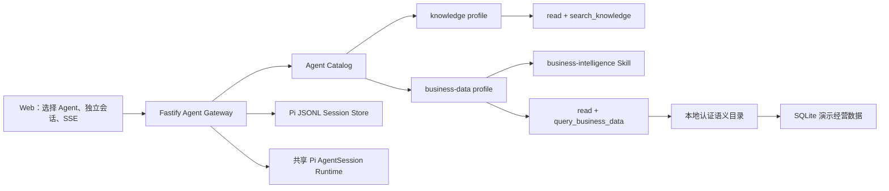

# Pi Workbench 多业务智能体设计

## 结论

Pi 是唯一 Agent Runtime。知识库问答与经营分析都是通过 `createAgentSession()` 创建的 Pi `AgentSession`，共享模型运行时、SSE 事件合同和 JSONL SessionManager，只在业务指令、Skill、工具 allowlist 和数据域上不同。

本设计不引入 Python Agent、第二套 Agent 框架或外部数据平台。

## 当前两个业务智能体

| Agent | 业务目标 | Pi Skills | 只读工具 |
|---|---|---|---|
| `knowledge` | 项目知识库问答 | 项目 Pi Skills | `read`、`search_knowledge` |
| `business-data` | 电商经营智能问数 | skills.sh 的 `business-intelligence` | `read`、`query_business_data` |

`business-intelligence` 通过 Skills CLI 安装在 `.agents/skills/business-intelligence/`，由经营分析 Agent 的 `DefaultResourceLoader.additionalSkillPaths` 加载。它提供 KPI 口径、语义层、数据新鲜度和业务叙事方法，不提供运行时权限，也不替代 Pi。

## 总体结构



Agent Gateway 根据用户显式选择的 `agentId` 注入 profile，不根据消息关键词预路由。进入 Pi 后，仍由 Pi 判断直接回答还是调用当前 profile 的工具。

## Agent 与会话隔离

每个 Session 在创建时写入不可变 JSONL custom entry：

```json
{
  "type": "custom",
  "customType": "pi-workbench.agent",
  "data": { "agentId": "business-data" }
}
```

核心规则：

- Session 只属于一个 Agent；
- 请求同时携带 `agentId` 和 `sessionId`；
- 服务端读取 JSONL binding 并校验；
- 不一致返回 `409 AgentSessionMismatch`，不能静默改绑；
- 运行时缓存键为 `agentId + ':' + sessionId`；
- 没有 binding 的历史 Session 兼容映射为 `knowledge`。

切换 Agent 会加载目标 Agent 自己的会话列表，没有历史时创建新的前端草稿会话，不复用消息数组和 Pi 上下文。

## 经营分析语义层

首版采用“认证指标目录”，不做任意 NL2SQL：

```text
用户业务问题
  -> Pi + business-intelligence Skill 理解业务意图
  -> query_business_data 选择一个认证 analysis ID
  -> 宿主把 analysis ID 映射为固定指标 / 维度 / 时间窗 / 枚举过滤
  -> 固定参数化 SQLite 聚合
  -> 带口径、负责人、时间范围和新鲜度的结果 envelope
  -> Pi 输出业务结论、含义与建议
```

### 认证分析目录

| Analysis ID | 业务问题 | 固定查询形态 |
|---|---|---|
| `regional_performance_30d` | 近 30 天区域经营排名 | 退款后销售额、订单量、客单价，按区域 |
| `channel_efficiency_30d` | 近 30 天渠道效率对比 | 退款后销售额、客单价、退款率，按渠道 |
| `live_category_refund_30d` | 直播渠道品类退款排名 | 退款率、退款后销售额，按品类并过滤直播 |
| `monthly_gmv_trend_90d` | 近 90 天月度 GMV 趋势 | GMV、订单量，按月份 |

Pi 只负责从自然语言选择一个 analysis ID，每个用户问题最多调用一次工具。模型不能自由拼指标数组、过滤条件或 SQL，因此业务演示的结果、延迟和成本更稳定。

### 认证指标

| ID | 名称 | 口径 |
|---|---|---|
| `gross_sales` | GMV | 已支付订单退款前成交总额 |
| `net_sales` | 退款后销售额 | GMV 扣除已记录退款；不等同于会计营收 |
| `order_count` | 支付订单量 | 完成支付的订单数量 |
| `average_order_value` | 退款后客单价 | 退款后销售额 / 支付订单量 |
| `refund_rate` | 退款率 | 退款金额 / GMV |

### 认证维度和筛选

- 维度：区域、渠道、品类、月份；
- 时间窗：近 7 天、近 30 天、近 90 天、全部；
- 区域：华东、华南、华北、西部；
- 渠道：直营网店、平台电商、直播；
- 品类：数码家电、家居生活、美妆个护、食品饮料；
- 每次最多返回 20 行，指标组合由认证 analysis 固定。

工具不接受 SQL、表名、列名、JOIN、表达式或身份范围。动态 SQL 只拼接宿主代码中的固定 allowlist 片段，所有筛选值通过 SQLite 参数绑定。

## 演示数据

本地 SQLite 提供 90 天确定性电商经营数据，截止 `2026-08-18`，覆盖 4 个区域、3 个渠道和 4 个品类。金额以整数分存储，查询结果再转换为元。

推荐业务演示问题：

1. “近 30 天各区域退款后销售额和订单量排名。”
2. “对比各渠道近 30 天客单价和退款率。”
3. “直播渠道哪个品类退款率最高？”
4. “按月份看近 90 天 GMV 趋势。”

“营收”“收入”等未认证词必须澄清，不能自动映射为 GMV 或退款后销售额。

## API 合同

| 方法 | 路径 | 用途 |
|---|---|---|
| `GET` | `/api/v1/agent/agents` | 返回两个 Pi Agent profile |
| `GET` | `/api/v1/agent/sessions?agentId=...` | 返回指定 Agent 的会话 |
| `POST` | `/api/v1/agent/sessions` | 以 `{ agentId }` 创建绑定会话 |
| `POST` | `/api/v1/agent/chat/stream` | 以 `{ agentId, sessionId, message }` 发起 Pi turn |

两个 Agent 最终都返回相同的 `AgentChatResponse` 和 SSE `start/event/thinking_delta/text_delta/done/error` 合同。响应中显式包含 `agentId` 和观察到的 route。

## Web 交互

左侧固定展示“知识库问答”和“经营分析智能体”。切换时：

1. 正在运行的 turn 不允许切换；
2. 加载目标 Agent 的 Session；
3. 更新欢迎语、建议问题、能力标签和输入框；
4. 保留项目文件视图，但关闭当前文件预览；
5. 对话消息继续展示 Pi thinking、工具过程、来源和运行指标。

## 扩展第三个业务 Agent

后续新增业务 Agent 时，继续复用 Pi Runtime，只新增一个 profile：

1. 在共享合同中增加稳定 `agentId`；
2. 定义业务描述、欢迎语、建议问题和只读工具集合；
3. 通过 `DefaultResourceLoader` 选择对应 Skills；
4. 使用 `defineTool()` 注册宿主能力；
5. 在 Session 创建时写入 binding；
6. 增加工具、隔离和完整对话验收。

若需要文件化配置，应使用 TypeScript/JSON/Markdown profile，由 Node 宿主读取后仍创建 Pi `AgentSession`。当前安装的 Pi SDK 是 TypeScript SDK，`.py` 不能作为 Pi Agent 定义直接加载；通过 Python 运行 Agent 会变成第二套技术栈，因此不在本设计内。

## 验收标准

1. 左侧可选择两个业务 Agent。
2. 每个 Agent 只显示自己的 Session。
3. 跨 Agent 复用 Session 返回 409。
4. API 重启后从 Pi JSONL 恢复 `agentId` 和消息。
5. 知识 Agent 只有 `read/search_knowledge`。
6. 经营分析 Agent 只有 `read/query_business_data`，并加载 `business-intelligence` Skill。
7. 问数工具只执行认证指标与参数化查询。
8. 工具结果包含指标定义、公式、负责人、粒度、时间窗、新鲜度和限制。
9. 业务演示问题能走完 Pi tool call、SQLite 查询、SSE 和 Markdown 回答。
10. PC 视口完成选择、会话切换、问数、重启恢复和错误状态验证。
