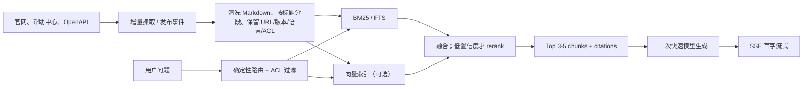

# 公司官网 Ask AI 的常见底层实现与低延迟最佳实践

> 调研快照：2026-08-01（Asia/Shanghai）。本文只采用厂商官方文档、官方博客和官方开源仓库；平台内部未公开的实现一律标为 **Inference（合理推断）** 或 **Not disclosed（未披露）**。

## 结论先行

1. **官网 Ask AI 的主流形态是预索引 RAG，而不是提问后临时爬网页。** 写路径提前抓取或同步官网内容，清洗为 Markdown/纯文本、分段并建立检索索引；读路径执行权限过滤、检索、可选重排，再把少量来源片段交给 LLM 生成带引用的答案。
2. **“最佳”通常不是纯向量。** 最透明的完整实现是关键词 BM25 与向量并行的 hybrid retrieval，再做融合和可选 rerank。产品名、错误码、API 字段等精确查询尤其依赖关键词；自然语言改写、同义表达才更受益于语义检索。
3. **也不是所有成熟产品都公开使用向量。** Algolia Ask AI 官方明确建立在 Algolia keyword index 上；Mintlify Search API 明确 semantic + keyword；GitBook 只确认 semantic answers 与 keyword search 并存；Intercom Fin 没有公开底层索引、向量库或 reranker。
4. **10 多秒往往不是检索本身造成，而是多次模型串行。** query rewrite、模型决定调工具、多轮 agentic retrieval、rerank、答案生成、生成后校验，每加一个模型阶段都会增加长尾。Cloudflare 官方也明确提示 query rewriting 与 reranking 会增加延迟。
5. **公开官网的默认快路径应是：应用先检索，一次 LLM 生成，立即流式。** 不要先让大模型 thinking 再决定要不要调用检索工具；只有复杂、多跳、需要实时外部系统的问题才进入 Agent 慢路径。
6. **感知速度与真实性同样重要。** 返回首批来源片段后立即 SSE 流式生成；引用必须来自检索结果的 URL/metadata，而不是让模型自行编 URL；低置信度时拒答、澄清或展示搜索结果。
7. **答案缓存有价值，但必须绑定内容版本与权限。** Cloudflare 已公开 similarity cache：MinHash + LSH 复用相似问题答案，并在依赖的文档 chunk 变化时清除缓存。私有知识不得使用忽略用户、权限组、语言和版本的粗粒度缓存键。

## 1. 已公开的平台实现

### 1.1 Mintlify Assistant

**Confirmed（官方确认）**

- Assistant 使用 agentic RAG 和 tool calling，当前官方页面称由 Claude Sonnet 4 驱动；模型会搜索文档、生成答案与代码示例，并返回可导航的来源链接；检索不到时明确拒答。[Assistant](https://www.mintlify.com/docs/guides/assistant)
- 官方 Search API 是 **semantic + keyword search**，支持分页、最低分数以及版本、语言、tag 等过滤。[Search documentation API](https://www.mintlify.com/docs/api/assistant/search)
- Assistant 会把检索内容作为 Markdown 取回，并可利用当前页面、选中文本、代码块和文件等上下文。[Assistant](https://www.mintlify.com/docs/assistant/index) · [Use the assistant](https://www.mintlify.com/docs/assistant/use)
- 发布内容变化后会更新索引；草稿分支、预览部署及按配置隐藏的页面不进入正常检索上下文。[Assistant](https://www.mintlify.com/docs/assistant/index) · [Hidden pages](https://www.mintlify.com/docs/organize/hidden-pages)
- 完全或部分认证文档的搜索与 Assistant 会遵守 user groups；官方 MCP 也只搜索当前用户有权访问的页面。[Authentication](https://www.mintlify.com/docs/deploy/authentication-setup) · [Mintlify MCP](https://www.mintlify.com/docs/ai/model-context-protocol)
- Assistant Message API 返回 AI SDK v5 兼容流，响应可含 text、reasoning、source URL 和 search tool result；`retrievalPageSize` 默认 5，官方提示取回更多页面可能更慢。[Create assistant message](https://www.mintlify.com/docs/api/assistant/create-message)

**Inference（合理推断）**

- Assistant 的文档搜索工具很可能复用或等价于其 semantic + keyword 检索能力，但官方没有确认内部 Assistant 一定调用公开 Search API。

**Not disclosed（未披露）**

- Embedding 模型、向量数据库、关键词引擎、融合权重、是否存在 cross-encoder reranker、答案缓存和 p50/p95。

### 1.2 GitBook AI Search 与 GitBook Assistant

**Confirmed（官方确认）**

- 基础搜索始终保留 keyword results；GitBook AI Search 为当前 docs site 生成简短答案，展示可展开 sources 和 related questions。[AI Search](https://gitbook.com/docs/publishing-documentation/search-and-gitbook-assistant)
- 内部 GitBook AI 提供 semantic answers；GitBook 表示内容交由 OpenAI 进行 index/process，内容变更最多可能一小时后反映到 AI search。[GitBook AI](https://gitbook.com/docs/content-editor/searching-your-content/gitbook-ai)
- 新 GitBook Assistant 使用 agentic retrieval，并结合当前页、此前阅读页和对话历史理解问题；还可以连接 MCP 获取实时外部数据或执行动作。[GitBook Assistant](https://gitbook.com/docs/publishing-documentation/gitbook-ai-assistant) · [Assistant launch](https://www.gitbook.com/blog/new-adaptive-content-gitbook-assistant)
- AI Search 只覆盖同一 docs site 内的 sections，不能跨独立 published sites；Assistant 的认证嵌入需要 visitor JWT，并可结合 Adaptive Content 的用户 claims。[AI Search](https://gitbook.com/docs/publishing-documentation/search-and-gitbook-assistant) · [Authenticated embeds](https://gitbook.com/docs/publishing-documentation/embedding/using-with-authenticated-docs)

**Inference（合理推断）**

- GitBook 很可能维护持久语义索引，并在查询时依据站点范围及用户 claims 限制上下文；但“semantic”不能直接证明特定向量库或具体 ANN 算法。

**Not disclosed（未披露）**

- 当前模型、embedding/向量库、hybrid 融合方式、reranker、缓存、SSE/token streaming 协议和延迟 SLO。

### 1.3 Intercom Fin

**Confirmed（官方确认）**

- Fin 可使用 Intercom 公共/内部文章、snippets、网页、PDF、Zendesk、Confluence、Guru、Notion 等来源。原生内容几乎即时 ingest；外部公开网站首次导入通常约 10 分钟、最坏可到 10 小时，之后按周更新。[Knowledge sources](https://www.intercom.com/help/en/articles/9440354-knowledge-sources-to-power-ai-agents-and-self-serve-support) · [Fin FAQ](https://www.intercom.com/help/en/articles/7837535-fin-ai-agent-faqs)
- Fin AI Engine 公开为三阶段：refine query；用 enhanced RAG 检索 content/data/actions 并生成；再验证回答是否充分、grounded、可信和安全，不满足时拒答、澄清或转人工。[Fin AI Engine](https://www.intercom.com/help/en/articles/9929230-the-fin-ai-engine)
- Fin 可用 Guidance 优先指定来源；公开来源可在 Messenger、chat 和 email 中以内联链接显示，非公开来源不会作为公开引用暴露。[Fin Guidance](https://www.intercom.com/help/en/articles/10210126-provide-fin-ai-agent-with-specific-guidance) · [Conversational Fin](https://www.intercom.com/help/en/articles/11433030-conversational-fin-experience)
- 内容可按 channel 和 audience 限制；Fin 不会使用客户无权访问的 private/restricted article。[Fin FAQ](https://www.intercom.com/help/en/articles/7837535-fin-ai-agent-faqs)
- Fin Agent API 支持 SSE `fin_reply_chunk`；Intercom 曾公开表示逐词流式平均减少约 6 秒感知等待，但这是历史产品数据，不代表当前端到端 SLO。[Fin Agent API](https://developers.intercom.com/docs/guides/fin-agent-api/setup) · [AI answer streaming](https://www.intercom.com/changes/en/27044-fin-just-got-a-whole-lot-faster-with-ai-answer-streaming)

**Inference（合理推断）**

- Fin 明显有 relevance selection/ranking 和 grounding validator，但不能据此断言它使用“向量召回 + cross-encoder rerank”，也不能断言三个阶段必然对应三次独立 LLM 请求。

**Not disclosed（未披露）**

- Embedding 模型、向量或倒排引擎、hybrid 策略、显式 reranker、答案缓存、当前 p50/p95。

### 1.4 Algolia DocSearch / Ask AI

**Confirmed（官方确认）**

- DocSearch 拆成 Crawler 与前端库；Crawler 默认每周运行，也可手动触发。Ask AI 在 Algolia index 上检索，再把结果交给自选 LLM 生成回答。[What is DocSearch](https://docsearch.algolia.com/docs/what-is-docsearch) · [Ask AI](https://www.algolia.com/doc/guides/algolia-ai/askai)
- Ask AI 官方描述为在 **keyword search** 上增加 conversational AI。官方建议为 Ask AI 单建 Markdown 文本索引：抓取 main content，按文本切成 records，并用 language/version/tag facets 过滤。[Ask AI](https://www.algolia.com/doc/guides/algolia-ai/askai) · [Markdown indexing](https://www.algolia.com/doc/guides/algolia-ai/askai/guides/markdown-indexing)
- Ask AI 默认每次 LLM 请求包含 7 个 search hits；可减少 hits、缩小 chunk、只取 snippet 或限制 record size，直接降低 token、成本与生成等待。[Reduce token usage](https://www.algolia.com/doc/guides/algolia-ai/askai/guides/cost-optimization)
- API 支持 facet/filters、限定检索与返回字段、去重；聊天响应通过 SSE 增量返回。HMAC chat token 有效期 5 分钟，并可限制 approved domains。[Ask AI API](https://www.algolia.com/doc/guides/algolia-ai/askai/reference/api) · [Safeguards](https://www.algolia.com/doc/guides/algolia-ai/askai/guides/safety)

**Inference（合理推断）**

- Ask AI 的公开配置显示当前主链路至少可以纯关键词运行；Algolia 产品另有 hybrid search 和 Dynamic Re-Ranking，不代表 Ask AI 默认自动启用它们。

**Not disclosed（未披露）**

- Ask AI 内部是否额外做向量召回、cross-encoder rerank、答案缓存，以及标准 UI 的引用数据协议。

### 1.5 Cloudflare AI Search：公开得最完整的参考流水线

Cloudflare 不一定代表上述各平台的内部实现，但它的官方文档完整公开了今天托管式 Ask AI/RAG 的典型结构：

```text
网站/R2/上传文件
  → Markdown 转换 → chunk
  → embedding/vector index + 可选 BM25 倒排索引
  → query rewrite（可选）
  → vector 与 BM25 并行 → fusion（hybrid）
  → cross-encoder rerank（可选）
  → Top-K chunk + source metadata
  → 一次生成 → SSE + citations
```

- 官方明确描述 Markdown 转换、chunk、embedding、BM25、hybrid fusion、cross-encoder rerank 和生成的完整顺序。[How AI Search works](https://developers.cloudflare.com/ai-search/concepts/how-ai-search-works/)
- Search API 只返回 chunks；Chat Completions 在一次接口中检索并生成。SSE 会先发 `chunks` 事件，再流式发送答案，UI 因而能先展示来源。[REST API](https://developers.cloudflare.com/ai-search/api/search/rest-api/)
- 每个 chunk 返回 URL/file key、时间、metadata、总分，以及可选 vector、BM25、fusion 和 reranking score；引用可直接由这些字段构造。[Chunk citations](https://developers.cloudflare.com/ai-search/how-to/chunk-citations/)
- Query rewriting 要额外调用 LLM；reranking 要增加第二阶段模型，官方都明确提示会增加延迟。[Query rewriting](https://developers.cloudflare.com/ai-search/configuration/retrieval/query-rewriting/) · [Reranking](https://developers.cloudflare.com/ai-search/configuration/retrieval/reranking/)
- Similarity cache 使用 MinHash + LSH 查找相似问题；命中立即返回，默认 TTL 48 小时，并与依赖 chunk 绑定，chunk 更新或删除时清除。[Similarity cache](https://developers.cloudflare.com/ai-search/configuration/retrieval/cache/)

### 1.6 Vercel AI SDK：实现工具，不是现成检索引擎

- AI SDK 提供 `streamText`、tool calling、embedding/cosine similarity 和独立 rerank API，但检索库、索引、权限、缓存和引用策略仍由应用决定。[streamText](https://ai-sdk.dev/docs/reference/ai-sdk-core/stream-text) · [Embeddings](https://ai-sdk.dev/docs/ai-sdk-core/embeddings) · [Reranking](https://ai-sdk.dev/docs/ai-sdk-core/reranking)
- Vercel 官方 RAG 模板使用 PostgreSQL + vector embeddings，并让模型通过 tool call 检索，再将结果实时 stream 到前端。[RAG template](https://vercel.com/templates/ai/ai-sdk-rag)
- 另一官方 Knowledge Agent 模板展示了无向量方案：同步内容到 snapshot repo，用受限的 `grep/find/cat` 工具搜索文件，再交给 AI SDK；它适合代码/文档 Agent，但多轮工具和复杂度路由不一定适合追求极低延迟的官网公共问答。[Knowledge Agent](https://vercel.com/templates/template/chat-sdk-knowledge-agent) · [Architecture](https://github.com/vercel-labs/knowledge-agent-template/blob/main/docs/ARCHITECTURE.md)

## 2. 推荐的“最佳”官网知识问答架构



### 写路径

1. 优先使用 Git/发布 webhook、CMS 事件或 sitemap 做增量更新，避免问答时抓网页。
2. 提取正文，去掉导航、页脚和重复模板；按 H1/H2/H3 和语义边界分段，并保留 canonical URL、anchor、title、language、version、updated_at、content hash 和 ACL。
3. 始终建立 BM25/FTS；需要同义问法和自然语言召回时再并行建立向量索引。公开官网完全可以先用 SQLite FTS5、Postgres FTS 或 Algolia 验证质量，不必一开始就引入复杂向量基础设施。
4. 文档发布时使受影响的 query/answer cache 失效；对私有内容，索引和缓存都必须能依据权限组过滤。

### 读路径

1. 在第一次模型调用前，由应用代码直接执行知识检索；不要默认让大模型先 thinking 再选择工具。
2. 导航型、URL 型、错误码或精确 API 字段查询优先 BM25，甚至直接返回页面，不调用 LLM。
3. 普通自然语言问题并行查 BM25 与向量，使用 RRF 等轻量融合；只有结果分散、低置信度或语料噪声高时才启用 reranker。
4. 向模型只发送 Top 3-5 个小片段和稳定的 citation IDs。提示词要求只依据片段回答，证据不足时明确说不知道。
5. 仅调用一次低 reasoning、低延迟模型，并立即 SSE streaming。引用由服务端把 citation ID 映射回真实 URL，不能依赖模型生成链接。
6. 多跳研究、实时业务数据、动作执行或用户明确选择“深度回答”时，才切换到 Agent + MCP/tools 的慢路径。

### 缓存与权限

- L1：标准化问题的精确缓存，key 至少含站点、语言、版本、权限范围和内容版本。
- L2：只对公开且稳定内容启用相似问题缓存；设较严格阈值，并记录答案依赖的 chunk IDs 以便定向失效。
- L3：缓存 query embedding、热门检索结果和文档片段；这通常比缓存最终生成答案风险更低。
- 私有知识不能把不同用户的答案混用。权限应在检索前或检索中施加，而不是先取回私密片段再要求 LLM 忽略。

## 3. 针对当前 10+ 秒问题的直接建议

当前链路若是“模型 thinking → tool call → 检索 → 模型总结”，优先改成：

```text
用户问题
  → 应用层并行 BM25/可选向量检索（无模型）
  → Top 3-5 片段与引用
  → 一次快速模型生成
  → 首 token 立即流式
```

建议先做以下四项，收益通常高于单纯替换向量数据库：

1. 移除首轮大模型路由和默认 thinking；知识库入口天然就应该检索。
2. 把 `search → read → summarize` 多工具回合合并为一次 `knowledge_context(query, filters, top_k, max_chars)`。
3. 简单问题不用 rerank/query rewrite；复杂问题才按置信度升级。
4. 记录每阶段 p50/p95：路由、检索、rerank、LLM TTFT、生成、总耗时和缓存命中率。

可以把以下数值作为内部工程目标，而不是厂商承诺：检索 p95 < 100 ms，简单问题 TTFT p95 < 2 秒，完整答案 p95 < 4-5 秒；超过 10 秒只允许出现在用户明确选择的深度模式。

## 4. 最终判断

对于公开公司官网，最稳妥的默认方案是 **“增量抓取/发布同步 + BM25 必选 + 向量可选 + 低置信度才 rerank + 一次快速生成 + SSE + 可验证引用 + 内容感知缓存”**。这比默认 Agent 多轮工具调用更快、更可测，也更容易做权限与引用正确性。

Agentic RAG 是 Mintlify、GitBook、Intercom 等产品增强复杂问答的方向，但它不应成为每个简单官网问题的唯一热路径。最佳产品通常同时存在三条路径：**直接搜索/跳转、单次 RAG 快答、Agent 深度问答**，并由确定性规则与检索置信度进行升级。
