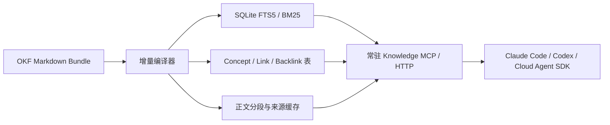

# okfcli/okf 底层实现与知识问答延迟分析

> 调研快照：2026-08-01（Asia/Shanghai）。源码基线为 `okfcli/okf` `main@a37a0726ac1defabd62bbb9f9e16d5d4e699630d`，规范基线为 Google `knowledge-catalog` `main@3fcbb9f828c2f23d109c855ee403c3a4c81f3a96` 的 OKF v0.2。本文只采用官方规范、官方仓库源码和官方 CI 配置。

## 结论先行

1. **okfcli 很轻，但当前并不是一个低延迟全文检索引擎。** 它是 Go 单二进制，运行时依赖只有 `yaml.v3`；没有远程 Embedding、向量数据库或 LLM 调用，因此小型、本地、低并发 Bundle 的单次命令通常具备较低的固定开销。[`go.mod`](https://github.com/okfcli/okf/blob/a37a0726ac1defabd62bbb9f9e16d5d4e699630d/go.mod) · [CLI 入口](https://github.com/okfcli/okf/blob/a37a0726ac1defabd62bbb9f9e16d5d4e699630d/cmd/okf/main.go#L35-L73)
2. **每次 `search`、`show`、`backlinks`、`graph` 都会重新遍历并解析整个 Bundle。** 当前没有常驻进程、持久化倒排索引、内存缓存或增量加载；`okf index` 生成的是供人和 Agent 渐进导航的 `index.md`，不是检索索引。[Bundle 加载](https://github.com/okfcli/okf/blob/a37a0726ac1defabd62bbb9f9e16d5d4e699630d/internal/bundle/bundle.go#L23-L92) · [`index` 实现](https://github.com/okfcli/okf/blob/a37a0726ac1defabd62bbb9f9e16d5d4e699630d/internal/index/index.go#L17-L121)
3. **`search --text` 只是大小写不敏感的字面子串匹配。** 它遍历所有 Concept，在 `title`、`description`、`body` 中执行 `strings.Contains`；没有 BM25、分词、相关性评分、Top-K、摘要片段、同义词、模糊匹配或图扩展。[搜索源码](https://github.com/okfcli/okf/blob/a37a0726ac1defabd62bbb9f9e16d5d4e699630d/internal/search/search.go#L18-L71)
4. **它不能单独解决现有知识库问答 10+ 秒的问题。** 它能消除远程检索/Embedding 的一部分开销，并提供可预测的 JSON 工具接口；但模型 thinking、模型决定调工具、`search` 后再 `show`、最终总结仍然存在。当前 `search` 只返回 ID、类型和标题，正文必须再取一次；两次 CLI 调用又分别全量加载 Bundle。[`search` 输出](https://github.com/okfcli/okf/blob/a37a0726ac1defabd62bbb9f9e16d5d4e699630d/cmd/okf/main.go#L382-L436) · [`show` 调用链](https://github.com/okfcli/okf/blob/a37a0726ac1defabd62bbb9f9e16d5d4e699630d/cmd/okf/main.go#L277-L308)
5. **推荐把 OKF 用作知识事实与治理格式，把在线问答交给一个预编译的非向量检索层。** 生产形态应是“OKF Markdown 源 → 增量编译 SQLite FTS5/BM25 + link/backlink 表 → 常驻 MCP/HTTP 服务 → 一次返回 Top-K 片段及引用 → 一次 LLM 总结”，而不是让 Claude Code/Codex 在每个问题里串行执行 `okf search`、`okf show`、`okf backlinks`。

## 1. OKF 与 okfcli 分别负责什么

Google 的 OKF v0.2 是文件格式，不是检索产品。规范把 Bundle 定义为带 YAML frontmatter 的 Markdown 目录树；目标是可读、可解析、可版本控制和可移植，并明确把“规定存储、服务或查询基础设施”列为非目标。[OKF v0.2 §1](https://github.com/GoogleCloudPlatform/knowledge-catalog/blob/3fcbb9f828c2f23d109c855ee403c3a4c81f3a96/okf/SPEC.md#L21-L68)

因此，OKF 本身不保证搜索速度。它提供的是可供搜索系统消费的稳定结构：

- 每个非保留 Markdown 文件是一个 Concept；Concept ID 是 Bundle 内路径去掉 `.md`。[OKF v0.2 §2–§4](https://github.com/GoogleCloudPlatform/knowledge-catalog/blob/3fcbb9f828c2f23d109c855ee403c3a4c81f3a96/okf/SPEC.md#L71-L153)
- frontmatter 中只有 `type` 永远必需，`title`、`description`、`resource`、`tags` 是推荐字段；正文仍是标准 Markdown。[OKF v0.2 §4](https://github.com/GoogleCloudPlatform/knowledge-catalog/blob/3fcbb9f828c2f23d109c855ee403c3a4c81f3a96/okf/SPEC.md#L153-L226)
- `sources`、`generated`、`verified`、`status`、`stale_after` 等字段提供来源、信任和新鲜度信号，适合在问答结果中过滤草稿、过期和未经验证的知识。[OKF v0.2 §5](https://github.com/GoogleCloudPlatform/knowledge-catalog/blob/3fcbb9f828c2f23d109c855ee403c3a4c81f3a96/okf/SPEC.md#L277-L433)
- `index.md` 的标准用途是列举目录内容，实现渐进披露；规范没有把它定义为倒排索引。[OKF v0.2 §8](https://github.com/GoogleCloudPlatform/knowledge-catalog/blob/3fcbb9f828c2f23d109c855ee403c3a4c81f3a96/okf/SPEC.md#L502-L527)

`okfcli/okf` 则是这个格式的早期 Go 工具箱：负责初始化、校验、生成导航页、列举、显示、字面搜索和构图。官方 README 仍把项目标为 **Early development**，`okf serve` 和可嵌入的 `okf-go` 都只是 Planned。[项目状态](https://github.com/okfcli/okf/blob/a37a0726ac1defabd62bbb9f9e16d5d4e699630d/README.md#L190-L199)

## 2. 命令入口与进程模型

`cmd/okf/main.go` 是唯一 CLI 入口，通过一个 `switch` 分发 `schema`、`init`、`validate`、`lint`、`index`、`graph`、`list`、`show`、`search`、`backlinks` 等命令。它不是 daemon，也没有进程内请求循环；每次调用都是新进程。[命令分发](https://github.com/okfcli/okf/blob/a37a0726ac1defabd62bbb9f9e16d5d4e699630d/cmd/okf/main.go#L35-L73)

这带来两个相反的性能特征：

- 好处：Go 单二进制启动简单，没有 Node/Python 解释器、远程网络和模型调用的固定成本。
- 限制：跨请求不能复用已解析的 Bundle、搜索索引或图；高频问答会重复支付进程启动、目录扫描、文件读取、YAML 解析和 JSON 编码成本。

`schema` 能一次性输出全部命令契约，JSON 错误也有稳定类型和退出码，适合 Agent 编排；但生产集成应在启动时缓存 schema，而不是每个问题重新调用。[JSON 与错误输出](https://github.com/okfcli/okf/blob/a37a0726ac1defabd62bbb9f9e16d5d4e699630d/cmd/okf/main.go#L75-L141) · [结构化错误](https://github.com/okfcli/okf/blob/a37a0726ac1defabd62bbb9f9e16d5d4e699630d/internal/cerr/errors.go#L41-L114)

## 3. Bundle 扫描、Markdown 与 YAML frontmatter

`bundle.Load` 的工作步骤是：

1. 将 Bundle 根目录转为绝对路径并确认是目录；
2. 用 `filepath.WalkDir` 遍历整棵树，跳过隐藏目录；
3. 对每个 `.md` 文件执行读取和解析；
4. 将 `index.md`、`log.md` 放入 `Reserved`，其他文件放入 `Concepts`；
5. 生成 `conceptByID` 哈希表并按 ID 排序全部 Concept。

源码没有 mtime/content-hash 判定、增量刷新或磁盘缓存。[`bundle.Load`](https://github.com/okfcli/okf/blob/a37a0726ac1defabd62bbb9f9e16d5d4e699630d/internal/bundle/bundle.go#L23-L103)

单文件解析也很直接：`os.ReadFile` 读入完整文件；frontmatter 必须从文件开头的 `---` 起，支持 BOM 和 CRLF；实现逐行寻找闭合 `---`，再用 `gopkg.in/yaml.v3` 反序列化，正文和原始 frontmatter 都保存在 `Concept` 中。保留文件可以没有 frontmatter。[Concept 读取与解析](https://github.com/okfcli/okf/blob/a37a0726ac1defabd62bbb9f9e16d5d4e699630d/internal/concept/concept.go#L145-L200) · [frontmatter 切分](https://github.com/okfcli/okf/blob/a37a0726ac1defabd62bbb9f9e16d5d4e699630d/internal/concept/concept.go#L217-L251)

由此可以推导：

- 单次加载时间至少与目录项数量和 Markdown 总字节量近似线性相关；大量小文件还会放大文件系统 metadata/open/read 成本。
- 常驻内存至少与已解析 frontmatter、正文和原始 frontmatter 总量同阶；解析期间还会产生字符串和 YAML 对象分配。
- 即使 `show` 最后通过 `conceptByID` 做 O(1) 查找，它之前仍然已经加载整棵 Bundle，所以不能把 `show` 视为一次 O(1) 磁盘读取。[`show.Show`](https://github.com/okfcli/okf/blob/a37a0726ac1defabd62bbb9f9e16d5d4e699630d/internal/show/show.go#L11-L18) · [`runShow`](https://github.com/okfcli/okf/blob/a37a0726ac1defabd62bbb9f9e16d5d4e699630d/cmd/okf/main.go#L277-L308)

## 4. `index` 是否持久化检索索引

**否。** `okf index` 遍历目录，为每个存在 Concept 或子目录的目录生成/覆盖 `index.md`，内容是标题、类型、截断到 80 字符的描述和子目录链接。它不写 term dictionary、posting list、BM25 统计或搜索数据库。[`index.Generate`](https://github.com/okfcli/okf/blob/a37a0726ac1defabd62bbb9f9e16d5d4e699630d/internal/index/index.go#L17-L121)

这类索引的优势是透明、可审阅，且能防止 Agent 一次把整库塞进上下文；它适合：

- 人工浏览；
- Agent 已经知道大致目录时的逐层导航；
- 离线生成主题目录或领域路由表。

但若让 LLM 在查询时逐层打开多个 `index.md`，可能增加模型—工具往返次数，反而不利于首字延迟。低延迟问答应让确定性代码直接查询预编译索引，`index.md` 作为可解释导航和降级路径。

## 5. 搜索算法与检索质量

当前 `search` 的算法是单次线性过滤：

- `--tag`：逐个 tag 执行 `strings.EqualFold`；
- `--type`：对 type 执行 `strings.EqualFold`；
- `--text`：将查询、标题、描述和正文转为小写，然后做 `strings.Contains`；
- 多种 filter 以 AND 组合；没有 filter 时返回全部 Concept。

源码见 [`internal/search/search.go`](https://github.com/okfcli/okf/blob/a37a0726ac1defabd62bbb9f9e16d5d4e699630d/internal/search/search.go#L11-L71)。

因此它在知识问答中的边界很明确：

| 能力 | 当前实现 |
| --- | --- |
| 精确 tag/type 过滤 | 支持，忽略大小写 |
| 中文字面短语 | 支持直接子串命中，但不分词 |
| 多关键词相关性 | 不支持评分；整段 `--text` 被当作一个连续子串 |
| 同义词、释义、语义相似 | 不支持 |
| BM25/FTS/倒排索引 | 不支持 |
| Top-K、分页、limit | 不支持 |
| 命中片段与高亮 | 不支持 |
| 图邻居扩展 | `search` 不支持 |

复杂度上，加载是 O(文件数 + Markdown 总字节量)，正文搜索又近似扫描候选正文总字节量。命中结果越多，最终 JSON 也越大；`runSearch` 会把所有命中编码为 `id/type/title`，没有 limit。[`runSearch`](https://github.com/okfcli/okf/blob/a37a0726ac1defabd62bbb9f9e16d5d4e699630d/cmd/okf/main.go#L382-L436)

## 6. Graph 与 backlinks

`graph.Build` 每次从零构建有向图。它为每个 Concept 提取：正文 Markdown links、frontmatter `links`，以及 OKF v0.2 的 `sources[].resource`、`computation`、`executor.resource`、`attester.resource`；然后解析相对/绝对路径、忽略外部/悬空/自链接、去重并排序节点和边。[Graph 构建](https://github.com/okfcli/okf/blob/a37a0726ac1defabd62bbb9f9e16d5d4e699630d/internal/graph/graph.go#L36-L86) · [v0.2 path refs](https://github.com/okfcli/okf/blob/a37a0726ac1defabd62bbb9f9e16d5d4e699630d/internal/graph/graph.go#L132-L155)

正文链接解析器不是完整 Markdown AST，而是按 `[`、`]`、`(`、`)` 扫描字符串；这很轻，但复杂 Markdown、嵌套括号等语法不能期待完整解析器级兼容。[链接提取](https://github.com/okfcli/okf/blob/a37a0726ac1defabd62bbb9f9e16d5d4e699630d/internal/validate/validate.go#L174-L235)

性能注意点：

- 构图需要扫描全部正文和链接，成本随语料总量和边数增长；节点、边以及 backlinks 都常驻内存。
- `appendUnique` 对每个目标的现有 backlink 切片做线性查重；高度密集的图会出现超线性的去重成本。[查重实现](https://github.com/okfcli/okf/blob/a37a0726ac1defabd62bbb9f9e16d5d4e699630d/internal/graph/graph.go#L119-L126)
- `graph` 命令会把全部 nodes 和 edges 一次性 `MarshalIndent` 后输出，不只是统计数字；大图还会增加 JSON 分配、stdout 传输和 Agent token 成本。[Graph JSON](https://github.com/okfcli/okf/blob/a37a0726ac1defabd62bbb9f9e16d5d4e699630d/cmd/okf/main.go#L219-L250) · [JSON 编码](https://github.com/okfcli/okf/blob/a37a0726ac1defabd62bbb9f9e16d5d4e699630d/cmd/okf/main.go#L109-L118)

还有一个当前实现落差：独立的 `backlinks` 命令只检查正文链接和 frontmatter `links`，没有纳入 `sources`、`computation`、`executor`、`attester` 这些 path-valued refs；而 `graph.Build` 纳入了。若生产逻辑依赖来源/计算链路，应该使用统一的预编译图，而不能假定两个命令的 backlink 语义完全一致。[独立 backlinks 实现](https://github.com/okfcli/okf/blob/a37a0726ac1defabd62bbb9f9e16d5d4e699630d/internal/backlinks/backlinks.go#L9-L38)

## 7. JSON 输出对 Agent 集成的价值与代价

所有成功结果使用 `json.MarshalIndent` 完整编码后一次性打印，错误则是稳定 envelope 与退出码；这避免 Claude Code/Codex 解析人类文本，能够减少脆弱的工具适配。[输出实现](https://github.com/okfcli/okf/blob/a37a0726ac1defabd62bbb9f9e16d5d4e699630d/cmd/okf/main.go#L109-L130) · [错误模型](https://github.com/okfcli/okf/blob/a37a0726ac1defabd62bbb9f9e16d5d4e699630d/internal/cerr/errors.go#L41-L114)

但它不是 JSONL 流，也没有 cursor/limit：

- `search` 可能输出所有匹配项；
- `list` 输出所有 Concept；
- `graph` 输出所有节点与边；
- `show` 输出完整正文。

大输出会增加编码时间、IPC/MCP 载荷和模型输入 token，并推迟工具输出可消费的时间。在线问答封装层应主动限制 Top-K、单片段字符数和总上下文预算。

## 8. 官方有没有性能 Benchmark

截至源码快照，仓库中没有 `func Benchmark...`、benchmark fixture、基准结果、QPS/p95 报告或大规模语料测试；CI 只运行 build、vet、race+coverage、lint 和漏洞扫描，不运行 benchmark。[官方 CI](https://github.com/okfcli/okf/blob/a37a0726ac1defabd62bbb9f9e16d5d4e699630d/.github/workflows/ci.yml#L20-L123)

README 写有“fast enough to validate millions of concepts”，但仓库没有公开证据把这句话对应到机器配置、文件大小、命令、耗时、内存或并发指标。[README 性能表述](https://github.com/okfcli/okf/blob/a37a0726ac1defabd62bbb9f9e16d5d4e699630d/README.md#L1-L9) 因此不能据此承诺知识问答的延迟，更不能把“validate 数百万 Concept”外推成“交互式 search 能达到某个 p95”。

### 本地合成趋势测试（非官方 Benchmark）

为了回答“实际会不会快”，另用官方 `v0.2.0`、同一提交 `a37a072` 的 macOS arm64 二进制在本地 SSD 做了一个合成抽样。每个 Concept 约 1.2 KB，内容高度重复；主要测试无命中的全文查询，并补测 10,000 个 Concept 下的全命中查询、`show` 与 `graph`。结果为手工观察的区间，不是严谨统计的 p50/p95：

| 合成规模 | 观测命令 | 本地耗时 |
| ---: | --- | ---: |
| 100 Concept | warm-cache 无命中 `search --text` | 0–10 ms |
| 1,000 Concept | warm-cache 无命中 `search --text` | 30–40 ms；首次约 70 ms |
| 10,000 Concept | warm-cache 无命中 `search --text` | 320–400 ms；首次约 630 ms |
| 10,000 Concept | 全命中 `search`、`show`、`graph` | 约 370–400 ms |

这个抽样与源码推导一致：文件数扩大约十倍时，耗时也大致按数量级增长；`show` 虽然最后只返回一个 Concept，仍因全量 `bundle.Load` 落在与全库命令相近的量级。它同时说明：中小型本地 Bundle 的 CLI 检索阶段可以很短，但 10,000 个小文件已是数百毫秒，若再叠加多次 Agent 工具往返、并发、真实大正文和 LLM 生成，不能把它当作“10 秒问题已经解决”。

测试限制必须同时保留：这不是上游发布的 benchmark；只测一台 macOS arm64 本地 SSD；没有报告峰值内存、并发、长尾、中文复杂语料或网络文件系统；合成内容高度重复且单文件很小。它只能说明当前实现的扩展趋势，不能成为生产 SLO。

## 9. 什么规模下可能变慢

在没有官方基准的前提下，只能从算法和系统调用判断风险，不宜给一个虚假的固定文件数阈值。以下情况会明显放大成本：

1. **文件很多**：每次命令都要 WalkDir、打开和读取所有 Markdown；数万/数十万小文件往往受 filesystem metadata 和 open/read 支配。
2. **正文很大**：Bundle 会把完整正文载入内存，`search --text` 又扫描候选正文；总字节量比单纯 Concept 数更关键。
3. **高 QPS 或多 Agent 并发**：每个 CLI 进程重复加载同一语料，既不能共享 page-level parse cache，也不能共享倒排索引。
4. **命中集合很大**：没有 limit，JSON 编码、传输和 LLM token 会膨胀。
5. **图很密**：全量构图、边输出和 backlink 线性查重会放大 CPU 与内存。
6. **串行工具链长**：`search → 模型判断 → show → 模型判断 → backlinks → 模型总结` 会把模型往返次数放在本地工具耗时之前成为主要瓶颈。

工程上应以 SLO 驱动选择：只要真实 Bundle 的热缓存 `search + show` 已经无法稳定落在给检索阶段分配的预算内，或者并发时 p95 抖动明显，就应切换到常驻预编译索引，而不是继续依赖 CLI 全量扫描。

## 10. 对现有 10+ 秒端到端链路的影响

现有链路是：

```text
模型 thinking → 决定工具 → 工具检索 → 模型读取结果 → 可能再取正文 → 最终总结
```

把检索工具换成 okfcli 后，各阶段的变化如下：

| 延迟阶段 | okfcli 能否优化 | 原因 |
| --- | --- | --- |
| 模型首轮 thinking / 意图理解 | 不能直接优化 | 发生在调用 CLI 之前 |
| 远程 Embedding/向量库网络 | 可以消除 | 当前检索完全本地、无向量、无网络 |
| 本地知识扫描 | 小库可能较轻；大库不保证 | 每次全量读取和解析 |
| 模型决定下一次 `show` | 不能直接优化 | `search` 不返回正文/片段，通常仍需第二轮 |
| 最终答案总结 | 不能直接优化 | okfcli 不生成自然语言答案 |
| 首字流式输出 | 不能直接提供 | CLI 只输出完整 JSON，最终 token 仍由模型产生 |

所以，如果当前 10+ 秒主要花在模型 thinking、两三轮工具决策和最终总结，把向量检索替换成 okfcli 只会削掉其中一小段。若仍让模型自主决定 `search` 和 `show`，端到端时延很可能依旧不可接受。

## 11. 推荐的低延迟非向量集成

### 11.1 把 OKF 作为事实源，不把当前 CLI 当在线搜索服务



`okf validate`、`okf index` 适合放在写入、发布或 CI 阶段；在线读取使用预编译索引。这样保留 OKF 的可移植、可审计和信任字段，同时获得非向量检索的低延迟与可排序性。

### 11.2 查询前确定性路由，避免让模型先决定是否检索

对知识库入口、`/kb` 命令、已知业务域或“根据公司知识回答”的会话，应用层应在第一次模型调用前直接检索。可以使用：

- 明确的产品入口/会话模式；
- 规则化意图词和领域映射；
- tag/type/目录路由；
- 极轻量分类器，但不要再用一个大型模型回合做路由。

这样把“模型 thinking → tool call → 模型继续”的两阶段调用压缩为“确定性检索 → 一次带上下文的模型生成”。

### 11.3 合并 `search + show + backlinks` 为一次工具调用

在线工具建议只暴露一个主路径：

```text
knowledge_context(query, top_k, max_chars, filters)
```

一次返回：

- 排好序的 Top-K Concept；
- 每项命中片段和必要正文段落；
- `id`、`path`、`title`、`sources`、`trust_tier`、`status`、`stale`；
- 一跳相关 Concept，但只返回有限数量；
- 可直接用于回答的引用标识。

不要把当前 CLI 的所有命令原样暴露给 LLM，让模型自己串行组合。

### 11.4 预编译、常驻与缓存

- 首次启动解析全库，之后按文件 mtime + 内容哈希增量更新；
- 常驻内存维护 `conceptID → parsed concept` 和 link/backlink adjacency；
- SQLite FTS5 维护标题、描述、正文、tag 的 BM25 索引；
- 查询缓存使用“规范化查询 + filters + Bundle revision”作为 key；
- Concept/片段缓存按内容哈希失效；
- 高频主题预生成短的 canonical answer context，而不是缓存未经治理的最终自然语言答案；
- 限制 Top-K、每片段长度和总字符/token，防止工具结果拖慢模型。

### 11.5 流式首字策略

低延迟的关键不是让本地 CLI 流式打印 JSON，而是让最终模型只调用一次并尽早流式输出：

1. 请求到达后由应用层立即并行执行词法检索、权限过滤和缓存读取；
2. 一旦有限上下文准备好，启动一次模型生成；
3. UI 立即消费模型 token stream；
4. 不在回答前额外运行“检索结果总结模型”；当前 Claude/Codex 直接综合短上下文；
5. 对简单、可确定回答可使用模板/结构化渲染，完全跳过第二个 LLM。

建议把延迟预算拆开观测：路由、检索、上下文组装、首个模型 token、完整回答分别打点。目标值应由真实模型和部署环境压测确定，不能从 okfcli README 推导。

## 12. 最终判断

**直接问题：“用 okfcli 会不会比较快？”**

- 相比“每次远程 Embedding + 向量数据库 + 第二个总结模型”，在小型本地 Bundle 上，okfcli 的确定性词法查询链路更简单，也有机会明显缩短检索阶段。
- 相比 SQLite FTS5/BM25、常驻内存索引或专用搜索服务，当前 okfcli 在线查询架构并不快：它没有持久化搜索索引，每个命令重新扫描和解析全库，且 `search` 与 `show` 通常需要两步。
- 它最适合担当 **OKF Bundle 的初始化、校验、治理、离线索引页生成和调试 CLI**；不应未经压测直接作为公司知识库高并发、低 p95 的在线检索核心。
- 针对现有 10+ 秒链路，优先级应是：**减少模型往返次数 > 在查询前确定性检索 > 常驻预编译非向量索引 > 严格限制上下文 > 最终模型单次流式生成**。OKF 负责知识格式与可信治理，okfcli 负责离线质量门，在线查询使用围绕 OKF 构建的低延迟 consumer。

## 一手来源索引

- [Google OKF v0.2 规范（固定提交）](https://github.com/GoogleCloudPlatform/knowledge-catalog/blob/3fcbb9f828c2f23d109c855ee403c3a4c81f3a96/okf/SPEC.md)
- [okfcli/okf README（固定提交）](https://github.com/okfcli/okf/blob/a37a0726ac1defabd62bbb9f9e16d5d4e699630d/README.md)
- [CLI 入口与 JSON 输出](https://github.com/okfcli/okf/blob/a37a0726ac1defabd62bbb9f9e16d5d4e699630d/cmd/okf/main.go)
- [Bundle 加载](https://github.com/okfcli/okf/blob/a37a0726ac1defabd62bbb9f9e16d5d4e699630d/internal/bundle/bundle.go)
- [Concept/YAML 解析](https://github.com/okfcli/okf/blob/a37a0726ac1defabd62bbb9f9e16d5d4e699630d/internal/concept/concept.go)
- [搜索实现](https://github.com/okfcli/okf/blob/a37a0726ac1defabd62bbb9f9e16d5d4e699630d/internal/search/search.go)
- [索引页生成](https://github.com/okfcli/okf/blob/a37a0726ac1defabd62bbb9f9e16d5d4e699630d/internal/index/index.go)
- [Graph 实现](https://github.com/okfcli/okf/blob/a37a0726ac1defabd62bbb9f9e16d5d4e699630d/internal/graph/graph.go)
- [Backlinks 实现](https://github.com/okfcli/okf/blob/a37a0726ac1defabd62bbb9f9e16d5d4e699630d/internal/backlinks/backlinks.go)
- [官方 CI](https://github.com/okfcli/okf/blob/a37a0726ac1defabd62bbb9f9e16d5d4e699630d/.github/workflows/ci.yml)
